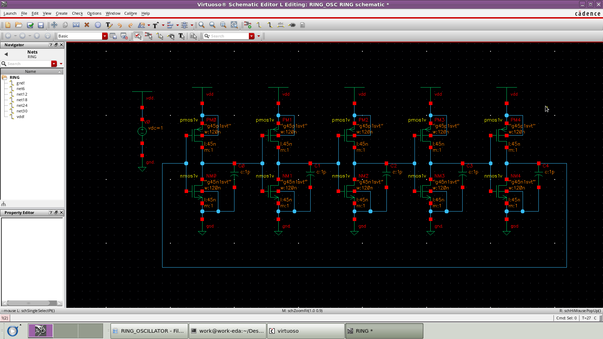
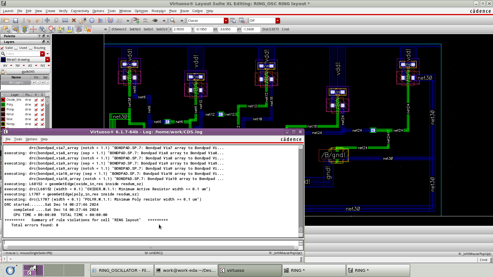
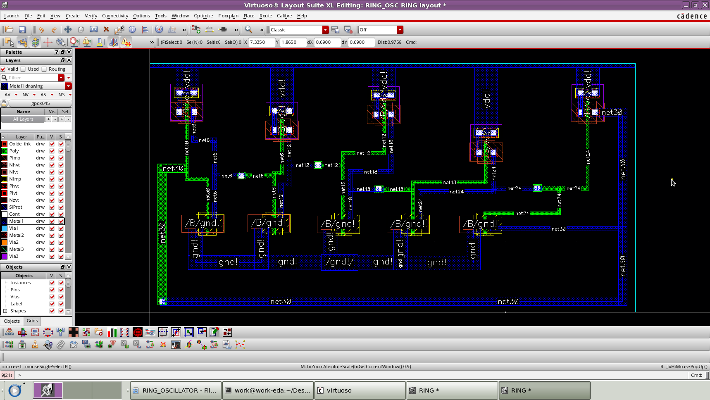
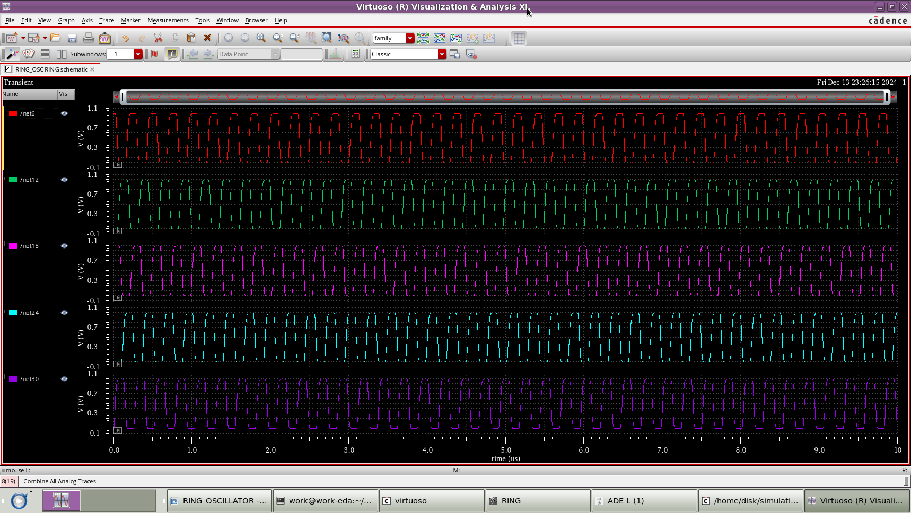

# 5-Stage Ring Oscillator

This project involves the design and analysis of a 5-stage ring oscillator using Cadence Virtuoso. The transient analysis is performed to verify oscillation behavior.

## 📷 Circuit Schematic

## 📐 DRC Check Output

## 🧱 Layout Design

## 📊 Transient Waveform

## 🛠️ Tools Used

- Cadence Virtuoso (Schematic, Layout, Simulation)
- Ubuntu/Linux Environment

## 👤 Author

**Mohanakrishnan E**  
BE ECE Analog VLSI Design Assignment  
